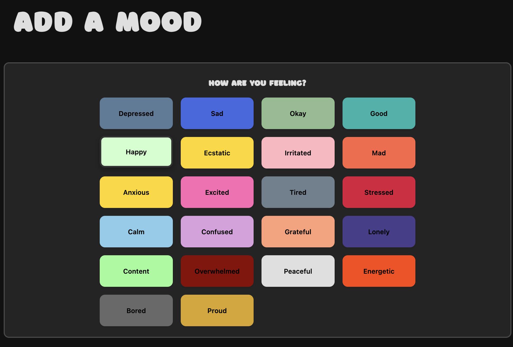

# Sanguine 🌙

A beautiful, dark-themed mood tracking web application that helps you monitor your emotional well-being over time. Sanguine provides an intuitive interface for logging daily moods, visualizing patterns through an interactive calendar, and gaining insights into your mental health journey.

*Built using modern web technologies by [Morgan Stewart.](https://github.com/morgantstewart)*

## Description

Sanguine is a comprehensive mood tracking application designed to create space for feeling your feelings and understanding emotional patterns. The app features a modern theme with elegant color-coded mood indicators, making mood tracking both visually appealing and psychologically comfortable.

### Key Features

- **Mood Logging**: Track 22 different mood types with color-coded selection interface
- **Interactive Calendar**: Visualize your mood history with color-coded daily indicators
- **Mood History**: Browse and manage all your logged moods with detailed views
- **User Authentication**: Secure login and registration system
- **Responsive Design**: Beautiful interface that works on all devices
- **Dark Theme**: Eye-friendly dark mode design for comfortable daily use

### Mood Types Supported

Sanguine tracks a comprehensive range of emotions including:
- Basic emotions: Happy, Sad, Angry, Calm, Excited
- Complex states: Anxious, Grateful, Overwhelmed, Content, Peaceful
- Energy levels: Tired, Energetic, Bored
- Social emotions: Lonely, Proud
- And many more!

## Getting Started

- GitHub Repo: https://github.com/morgantstewart/sanguinemood
- Project Management Board: https://trello.com/b/Ngl8w7ew/sanguine-mood-tracker-app

### Instructions
1. **Register** for a new account or **Login** if you already have one
2. **Log your first mood** by clicking "Log New Mood"
3. Select your current feeling from the color-coded mood grid
4. Add an optional description of your day
5. View your **Calendar** to see your mood patterns over time
6. Browse **All Moods** to review your mood history

## Technologies Used

### Backend
- **Django 4.x** - Python web framework
- **PostgreSQL** - Database
- **Python 3.8+** - Programming language

### Frontend
- **HTML5** - Markup language
- **CSS3** - Styling with custom properties and modern layouts
- **JavaScript** - Interactive mood selection functionality
- **Django Templates** - Server-side templating

### Design & UI
- **Custom CSS Framework** - Dark theme with CSS variables
- **Responsive Design** - Mobile-first approach
- **Color Psychology** - Mood-specific color coding system
- **Modern Typography** - Custom font integration (Borsok, Oswald, Bebas Neue)

### Development Tools
- **Django Admin** - Backend administration interface
- **Django Migrations** - Database schema management
- **Django Class-Based Views** - Clean, reusable view components
- **Custom Template Tags** - Enhanced template functionality

## Features in Detail

### Mood Tracking
- **22 distinct mood types** with unique color coding
- **Custom descriptions** for each mood entry
- **Date selection** for backdating mood entries
- **Visual mood selection** with hover effects and animations

### Calendar View
- **Monthly calendar display** with mood indicators
- **Color-coded days** showing dominant mood
- **Multiple moods per day** support
- **Interactive navigation** between months
- **Mood legend** for easy reference

### User Experience
- **Intuitive navigation** with sticky header
- **Consistent dark theme** throughout the application
- **Responsive design** for mobile and desktop
- **Smooth animations** and hover effects
- **Accessible color contrasts** for readability

## Next Steps
- Analytics dashboard to visualize mood data
- Public/sharable mood logs
- Photo upload functionality
- Download all mood data via CSV

## Attributions

### Code Resources
- https://alexpnt.github.io/2017/07/15/django-calendar/
- https://jme2791.medium.com/step-by-step-guide-to-creating-a-fullstack-mood-tracker-crud-app-with-react-node-js-and-sqlite-5553765b9804
- https://python.plainenglish.io/the-day-i-automated-my-mood-tracker-with-python-339d02a4f134

### Assets 
-  https://fonts.google.com/specimen/Bagel+Fat+One

### Research
- https://www.calm.com/blog/mood-monitoring
